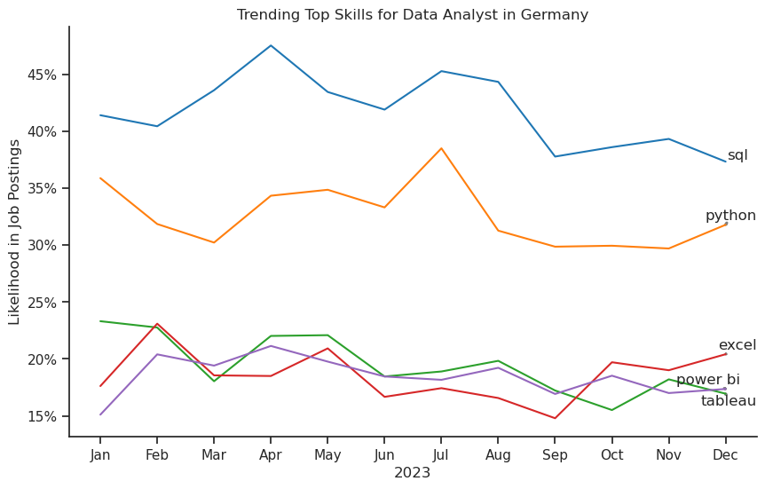
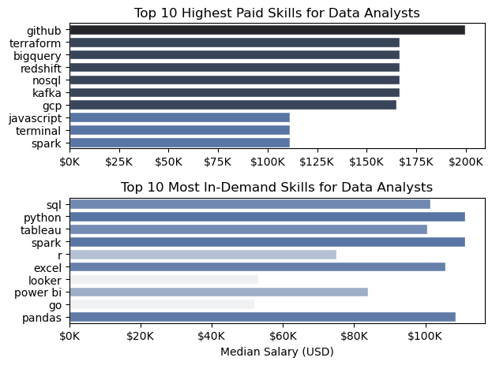

# Overview

Welcome to my analysis of the data job market, focusing on data analyst roles. This project was created out of a desire to navigate and understand the job market more effectively. It delves into the top-paying and in-demand skills to help find optimal job opportunities for data analysts.

The data sourced from [Hugging Face](https://huggingface.co/datasets/lukebarousse/data_jobs) which provides a foundation for my analysis, containing detailed information on job titles, salaries, locations, and essential skills. Through a series of Python scripts, I explore key questions such as the most demanded skills, salary trends, and the intersection of demand and salary in data analytics.

# The Questions

Below are the questions I want to answer in my project:

1. What are the skills most in demand for the top 3 most popular data roles?
2. How are in-demand skills trending for Data Analysts?
3. How well do jobs and skills pay for Data Analysts?
4. What are the optimal skills for data analysts to learn? (High Demand AND High Paying)

# Tools I Used

For my deep dive into the data analyst job market, I harnessed the power of several key tools:

- **Python:** The backbone of my analysis, allowing me to analyze the data and find critical insights.I also used the following Python libraries:
  - **Pandas Library:** This was used to analyze the data.
  - **Matplotlib Library:** I visualized the data.
  - **Seaborn Library:** Helped me create more advanced visuals.
- **Jupyter Notebooks:** The tool I used to run my Python scripts which let me easily include my notes and analysis.
- **Visual Studio Code:** My go-to for executing my Python scripts.
- **Git & GitHub:** Essential for version control and sharing my Python code and analysis, ensuring collaboration and project tracking.

# Data Preparation and Cleanup

This section outlines the steps taken to prepare the data for analysis, ensuring accuracy and usability.

## Import & Clean Up Data

I start by importing necessary libraries and loading the dataset, followed by initial data cleaning tasks to ensure data quality.

```python
# Importing Libraries
import ast
import pandas as pd
import seaborn as sns
from datasets import load_dataset
import matplotlib.pyplot as plt

# Loading Data
dataset = load_dataset('lukebarousse/data_jobs')
df = dataset['train'].to_pandas()

# Data Cleanup
df['job_posted_date'] = pd.to_datetime(df['job_posted_date'])
df['job_skills'] = df['job_skills'].apply(lambda x: ast.literal_eval(x) if pd.notna(x) else x)
```

## Filter Germany Jobs

To focus my analysis on the German job market, I apply filters to the dataset, narrowing down to roles based in Germany.

```python
df_de = df[df['job_country'] == 'Germany']

```

# The Analysis

Each Jupyter notebook for this project aimed at investigating specific aspects of the data job market. Here’s how I approached each question:

## 1. What are the most demanded skills for the top 4 most popular data roles?

To find the most demanded skills for the top 4 most popular data roles. I filtered out those positions by which ones were the most popular, and got the top 5 skills for these top 4 roles. This query highlights the most popular job titles and their top skills, showing which skills I should pay attention to depending on the role I'm targeting.

View my notebook with detailed steps here: [2_Skills_Demand](3_Project/2_Skills_Demand.ipynb).

### Visualize Data

```python
fig, ax = plt.subplots(int(len(top_data_jobs_de)/2), 2)
sns.set_theme(style="ticks")

for i, job_title in enumerate(top_data_jobs_de):
  df_plot = df_merged[df_merged["job_title_short"] == job_title].head()
  ax_plot = ax[int(i/2),i%2]

  sns.barplot(df_plot, x="job_skill_percent", y="job_skills", ax=ax_plot, legend=False, hue="job_count", palette="dark:b_r")

plt.show()
```

### Results


_Bar graph visualizing the salary for the top 4 data roles and their top 5 skills associated with each._

### Insights:

- SQL is the most requested skill for Data Analysts with 41% of job posts asking for it. For Data Engineers & Data Sceintists, Python is the most sought-after skill, appearing in 53% and 62% of job postings respectively.
- Data Engineers and Data Scientists require more specialized technical skills (AWS, Azure, Spark) compared to Data Analysts who are expected to be proficient in more general data management and analysis tools (Excel, Tableau).
- Python is a versatile skill, highly demanded across all three roles, but most prominently for Data Scientists (62%) and Data Engineers (53%).

## 2. How are in-demand skills trending for Data Analysts?

To find how skills are trending in 2023 for Data Analysts, I filtered data analyst positions and grouped the skills by the month of the job postings. This got me the top 5 skills of data analysts by month, showing how popular skills were throughout 2023.

View my notebook with detailed steps here: [3_Skills_Trend](3_Project/3_Skills_Trend.ipynb).

### Visualize Data

```python

from matplotlib.ticker import PercentFormatter

sns.lineplot(df_de_DA_pivot, dashes=False, legend=False, palette="tab10")

plt.gca().yaxis.set_major_formatter(PercentFormatter(decimals=0))

plt.show()

```

### Results

  
_Bar graph visualizing the trending top skills for data analysts in Germany in 2023._

### Insights:

- SQL Dominates the Market:

  SQL is consistently the most in-demand skill, with demand ranging around 40-50% likelihood in job postings throughout the year.
  There is a slight dip during the second half of the year, but SQL remains the top skill.

- Python's Significant Role:

  Python starts the year strong, second only to SQL, with a steady demand above 30%.
  The demand fluctuates slightly but remains consistent, highlighting Python's importance in data analytics roles.

- Excel's Gradual Rise:

  Excel shows moderate demand, starting lower but rising towards the end of the year.
  It peaks slightly in Q4, suggesting a renewed emphasis on basic analytical tools.

- Power BI and Tableau Compete Closely:

  Both Power BI and Tableau maintain a close competition throughout the year.
  Their demand hovers between 15-20%, showing consistent but slightly lower demand compared to programming and database skills.

- Seasonal Trends:

  SQL and Python show a dip during the late summer months (around August/September).
  Tools like Excel, Power BI, and Tableau show slight increases during the same period, possibly reflecting shifts in job requirements or hiring trends.

## 3. How well do jobs and skills pay for Data Analyst?

To identify the highest-paying roles and skills, I only got jobs in Germany and looked at their median salary. But first I looked at the salary distributions of common data jobs like Data Scientist, Data Engineer, and Data Analyst, to get an idea of which jobs are paid the most.

View my notebook with detailed steps here: [4_Salary_Analysis](3_Project/4_Salary_Analysis.ipynb).

#### Visualize Data

```
sns.boxplot(df_de_jobs, x="salary_year_avg", y="job_title_short", order=job_order)

ax = plt.gca()
ax.get_xaxis().set_major_formatter(plt.FuncFormatter(lambda val, _: f"${int(val/1000)}K"))
plt.ylabel("")
plt.xlabel("Yearly Salary (USD)")
plt.xlim((0, 300_000))
plt.show()

```

#### Results

  
_Box plot visualizing the salary distributions for the top 6 data job titles._

#### Insights

- Data Analyst:
  Median Salary: The lowest among the roles, around $50,000–$60,000.
  Range: Salaries vary widely, with some outliers reaching up to $100,000.

- Senior Data Analyst:
  Median Salary: Higher than Data Analysts, around $80,000–$90,000.
  Range: Smaller spread compared to Data Analysts, with fewer outliers.

- Data Scientist:
  Median Salary: Around $110,000, showing a significant jump from Senior Data Analysts.
  Range: Wide spread from $80,000 to $150,000, with some outliers above $200,000.

- Senior Data Scientist:
  Median Salary: Among the highest, around $130,000–$140,000.
  Range: A tighter distribution compared to Data Scientists but with notable outliers above $200,000.

- Data Engineer:
  Median Salary: Comparable to Data Scientists, around $110,000.
  Range: Wide salary distribution, similar to Data Scientists.

- Senior Data Engineer:
  Median Salary: Slightly higher than Data Engineers, around $125,000–$135,000.
  Range: A relatively narrower spread compared to Data Engineers.

General Observations:

- Salary Progression:
  There's a clear trend where senior roles (Senior Data Analyst, Senior Data Scientist, Senior Data Engineer) earn significantly more than their junior counterparts.
- Data Scientists and Engineers:
  that of Senior Data Scientists.
- Outliers:
  High outliers are present in most roles, particularly for Data Scientist and Senior Data Scientist roles, suggesting occasional exceptionally high salaries.
- Roles with the Most Variation:
  Data Engineers and Data Scientists have the widest salary ranges, indicating a mix of junior to highly experienced professionals in the market.

This analysis suggests that pursuing senior roles in data science or engineering offers significant earning potential, and specialization as a Data Scientist or Engineer may lead to higher variability and opportunities for top earnings.

## 4. Highest Paid & Most Demanded Skills for Data Analysts

Next, I narrowed my analysis and focused only on data analyst roles. I looked at the highest-paid skills and the most in-demand skills. I used two bar charts to showcase these.

View my notebook with detailed steps here: [5_Salary_VS_Skill_Analysis](3_Project/5_Salary_VS_Skill_Analysis.ipynb).

#### Visualize Data

```python

fig, ax = plt.subplots(2, 1)
sns.set_theme(style="ticks")

sns.barplot(
  df_top_paying_skills,
  x="median",
  y=df_top_paying_skills.index,
  hue="median",
  palette="dark:b_r",
  ax=ax[0],
  legend=False
)
ax[0].set_title("Top 10 Highest Paid Skills for Data Analysts")
ax[0].set_ylabel("")
ax[0].set_xlabel("")
ax[0].xaxis.set_major_formatter(plt.FuncFormatter(lambda val, _: f"${int(val/1000)}K"))

sns.barplot(
  df_top_asked_skills,
  x="median",
  y=df_top_asked_skills.index,
  hue="median",
  palette="light:b",
  ax=ax[1],
  legend=False
)
ax[1].set_title("Top 10 Most In-Deman Skills for Data Analysts")
ax[1].set_ylabel("")
ax[1].set_xlabel("Median Salary (USD)")
ax[1].xaxis.set_major_formatter(plt.FuncFormatter(lambda val, _: f"${int(val/1000)}K"))

plt.tight_layout()

plt.show()

```

#### Results

Here's the breakdown of the highest-paid & most in-demand skills for data analysts in Germany:


_Two separate bar graphs visualizing the highest paid skills and most in-demand skills for data analysts in Germany._

#### Insights:

- The top graph shows specialized technical skills like `dplyr`, `Bitbucket`, and `Gitlab` are associated with higher salaries, some reaching up to $200K, suggesting that advanced technical proficiency can increase earning potential.

- The bottom graph highlights that foundational skills like `Excel`, `PowerPoint`, and `SQL` are the most in-demand, even though they may not offer the highest salaries. This demonstrates the importance of these core skills for employability in data analysis roles.

- There's a clear distinction between the skills that are highest paid and those that are most in-demand. Data analysts aiming to maximize their career potential should consider developing a diverse skill set that includes both high-paying specialized skills and widely demanded foundational skills.

## 5. What are the most optimal skills to learn for Data Analysts?

To identify the most optimal skills to learn ( the ones that are the highest paid and highest in demand) I calculated the percent of skill demand and the median salary of these skills. To easily identify which are the most optimal skills to learn.

View my notebook with detailed steps here: [6_Optimal_Skills](3_Project/6_Optimal_Skills.ipynb).

#### Visualize Data

```python
from adjustText import adjust_text
import matplotlib.pyplot as plt

plt.scatter(df_DA_skills_high_demand['skill_percent'], df_DA_skills_high_demand['median_salary'])
plt.show()

```

#### Results

  
_A scatter plot visualizing the most optimal skills (high paying & high demand) for data analysts in Germany._

#### Insights:

- The skill `Github` appears to have the highest median salary of nearly $200K, despite being less common in job postings. This suggests a high value placed on version-control skills within the data analyst profession.

- More commonly required skills like `SQL` have a large presence in job listings but lower median salaries compared to specialized skills like `Python`, which not only have higher salaries but are also moderately prevalent in job listings.

- Skills such as `Python`, `Tableau` are towards the higher end of the salary spectrum while also being fairly common in job listings, indicating that proficiency in these tools can lead to good opportunities in data analytics.

### Visualizing Different Techonologies

Let's visualize the different technologies as well in the graph. We'll add color labels based on the technology (e.g., {Programming: Python})

#### Visualize Data

```python
from matplotlib.ticker import PercentFormatter

# Create a scatter plot
scatter = sns.scatterplot(
    data=df_DA_skills_tech_high_demand,
    x='skill_percent',
    y='median_salary',
    hue='technology',  # Color by technology
    palette='bright',  # Use a bright palette for distinct colors
    legend='full'  # Ensure the legend is shown
)
plt.show()

```

#### Results

  
_A scatter plot visualizing the most optimal skills (high paying & high demand) for data analysts in Germany with color labels for technology._

#### Insights:

- High Salary, Low Demand:

  GitHub and GCP command the highest median salaries (~$200K and ~$160K, respectively) but are required in relatively few job postings, indicating they are niche, high-value skills.

- High Demand, Moderate Salary:

  SQL and Python are in the highest demand (appearing in ~40%-50% of postings) but offer median salaries around $100K–$120K, reflecting their foundational role in the field.

- Balanced Skills:

  Tools like Spark, Tableau, and pandas strike a balance between salary (~$120K) and moderate demand (~20%-30%), making them valuable additions to a data analyst’s skillset.

- Low Demand, Lower Salary:

  Skills like Go and Looker have low demand (<10%) and the lowest salaries (<$70K), indicating they are less critical for most data analyst roles in Germany.

# What I Learned

Throughout this project, I deepened my understanding of the data analyst job market and enhanced my technical skills in Python, especially in data manipulation and visualization. Here are a few specific things I learned:

- **Advanced Python Usage**: Utilizing libraries such as Pandas for data manipulation, Seaborn and Matplotlib for data visualization, and other libraries helped me perform complex data analysis tasks more efficiently.
- **Data Cleaning Importance**: I learned that thorough data cleaning and preparation are crucial before any analysis can be conducted, ensuring the accuracy of insights derived from the data.
- **Strategic Skill Analysis**: The project emphasized the importance of aligning one's skills with market demand. Understanding the relationship between skill demand, salary, and job availability allows for more strategic career planning in the tech industry.

# Insights

This project provided several general insights into the data job market for analysts:

- **Skill Demand and Salary Correlation**: There is a clear correlation between the demand for specific skills and the salaries these skills command. Advanced and specialized skills like Python and Oracle often lead to higher salaries.
- **Market Trends**: There are changing trends in skill demand, highlighting the dynamic nature of the data job market. Keeping up with these trends is essential for career growth in data analytics.
- **Economic Value of Skills**: Understanding which skills are both in-demand and well-compensated can guide data analysts in prioritizing learning to maximize their economic returns.

# Challenges I Faced

This project was not without its challenges, but it provided good learning opportunities:

- **Data Inconsistencies**: Handling missing or inconsistent data entries requires careful consideration and thorough data-cleaning techniques to ensure the integrity of the analysis.
- **Complex Data Visualization**: Designing effective visual representations of complex datasets was challenging but critical for conveying insights clearly and compellingly.
- **Balancing Breadth and Depth**: Deciding how deeply to dive into each analysis while maintaining a broad overview of the data landscape required constant balancing to ensure comprehensive coverage without getting lost in details.

# Conclusion

This exploration into the data analyst job market has been incredibly informative, highlighting the critical skills and trends that shape this evolving field. The insights I got enhance my understanding and provide actionable guidance for anyone looking to advance their career in data analytics. As the market continues to change, ongoing analysis will be essential to stay ahead in data analytics. This project is a good foundation for future explorations and underscores the importance of continuous learning and adaptation in the data field.
